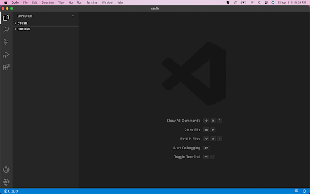
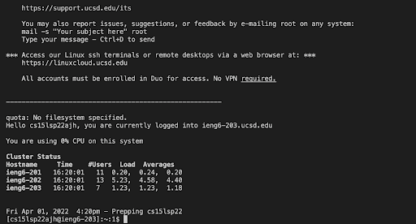
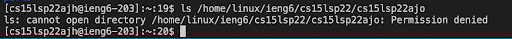
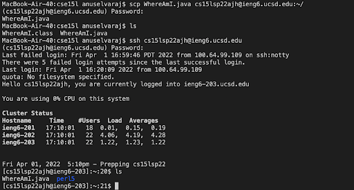
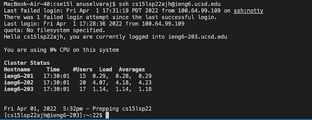
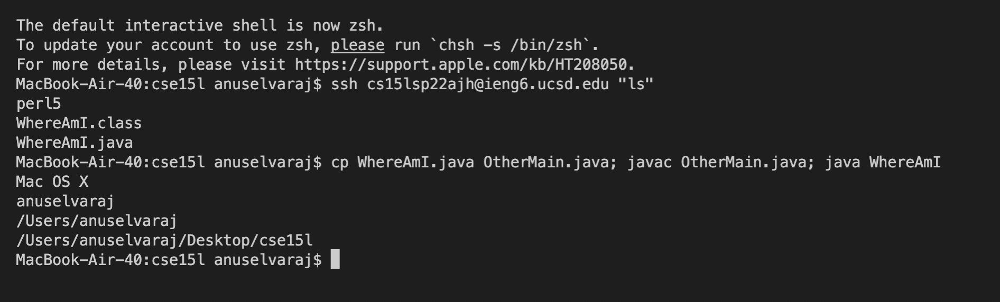

# Lab Report 1  
### 1. Downloading VSCode  
For this step, we have to go  to [visual studio code](https://code.visualstudio.com/) and download the VSCode app. After downloading your screen should look something like this:   

### 2. Remotely Connecting  
Next, we have to open up a new terminal in VSCode and run this command in order to remotely connect to a computer in the CSE Basement: `ssh cs15lsp22zz@ieng6.ucsd.edu`, but instead of zz put in your username. Now when we run commands in this client, it runs on the server of the CSE computers. This is what should show up after running the command:  

### 3. Trying Some Commands  
Now we can try different commands in the server and see what each one does. We can try commands like `ls` that lists all of the directory contents and try other commands like `ls -l`, `ls -a`, `ls -t`, and see what happens when you combine these in `ls -lat`. Another comamnd to try is `ls </home/linux/ieng6/cs15lsp22/cs15lsp22abc>` but put in another persons username in place of abc.  
  
This commands tries to access another person's directory files and it shows you that this access is denied.

### 4. Moving Files with `scp`
Here we create a new file called WhereAmI.java and run this command `scp WhereAmI.java cs15lsp22zz@ieng6.ucsd.edu:~/` except substitute the zz with your username. This command allows us to remotely copy files from your computer to another. After putting in your password, log in with `ssh` again. Now when we  run our files, we will be running it in the ieng server.  
 

### 5. Setting an `ssh` Key
In order to not have to enter a password every time we log in, we can set an `ssh` key so that this process can be expedited. Using ssh keygen, we can create a public key somewhere in the server and a private key somewhere in the client. This allows us to log in with no password the next time. First, using the `$ ssh-keygen` command, we set a file for the key and then enter an empty passcode and the public key is saved. Then we copy the public key into our server `ssh`. After these steps the login should look like this:  
 

### 6. Optimizing Remote Running  
Now we can practice making changes even more efficiently. One example of this is writing commands in quotes at the end of our ssh commands in order to consolidate our steps. Also, we can run multiple commands in the same lines separated by semicolons.  
 
