# Lab Report 2 Week 4  

## Streamlining 'ssh' Configuration   

### 1. Creating and Editing a config file    
- First we create a config file in our .ssh folder, then we open this in VSCode.   
- Then we edit our file and add this code to our file in order to have a shortcut to logging into our ieng6 server.   
- 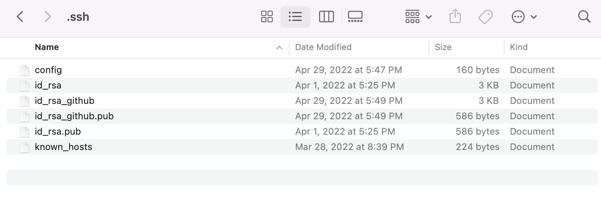   
- 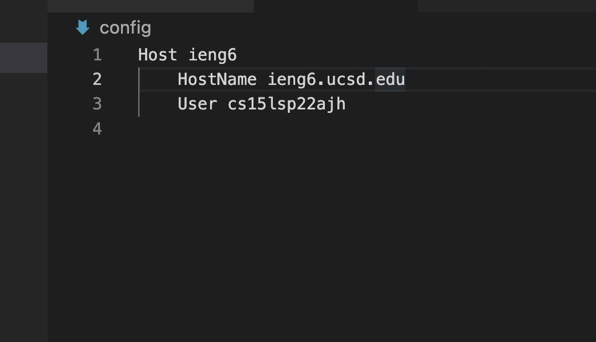   
### 2. SSH Log in with Shortcut   
- This shows how we are able to log in using just the shortcut we created.   
- 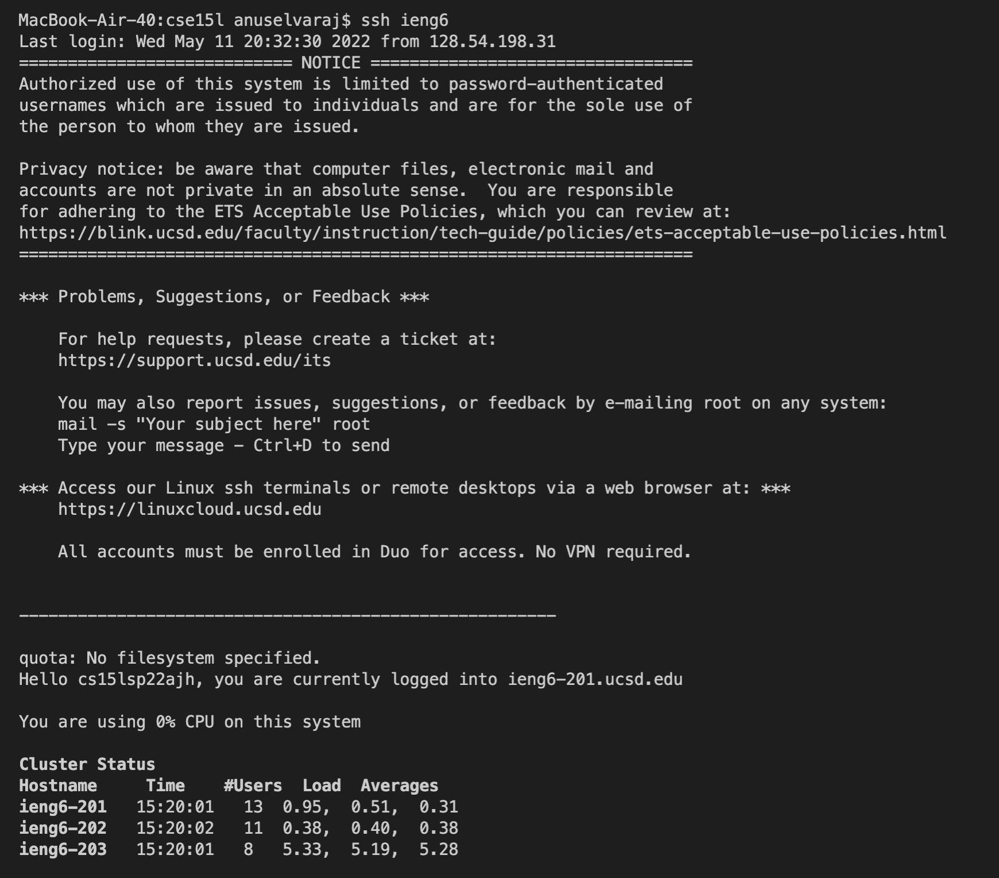   
## 3. Remotely copying files over with our shortcut   
- Then, we can try to use scp to copy a file over using our shortcut.   
- 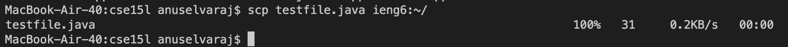   
- 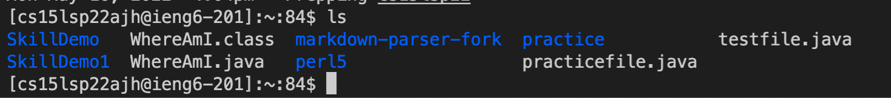   

## Setup GitHub Access from ieng6   

### 1. GitHub Public Key   
- First we make a public key and store this key in GitHub   
- 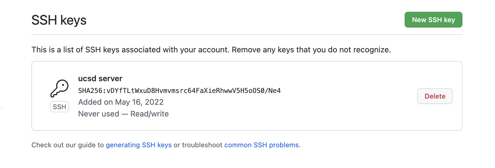   
- This is where it is kept in our user account in id_rsa.pub   
- 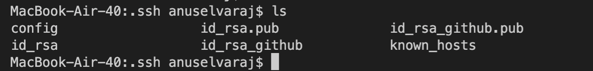   
### Using Git commands from the terminal   
- Here we can commit and push a change to github from our terminal   
- 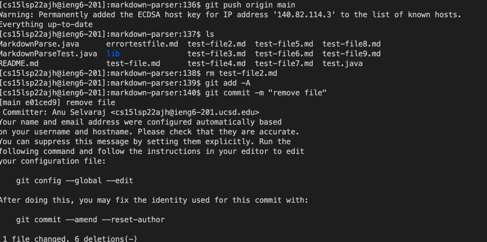   
- 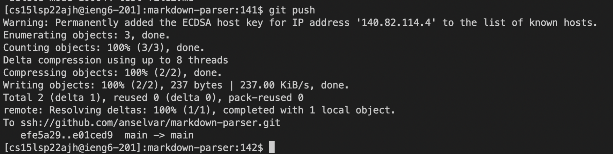   
### Link for resulting commit   
- [commit](https://github.com/anselvar/markdown-parser/commit/e01ced9bd8288eacf8960cae691ca82d99aa2cdc)   
## Copy whole directories using 'scp r'   

### Copy whole markdown parser directory to ieng6 account   
- Using this command we can remote copy our entire directory   
- 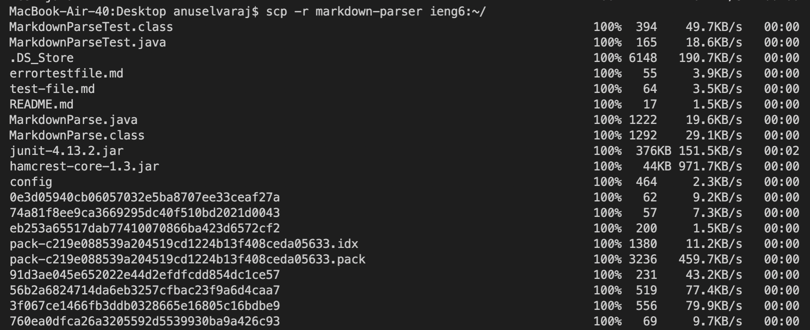   
### Log in to ieng6 and run our tests   
- Now we can test our file   
- 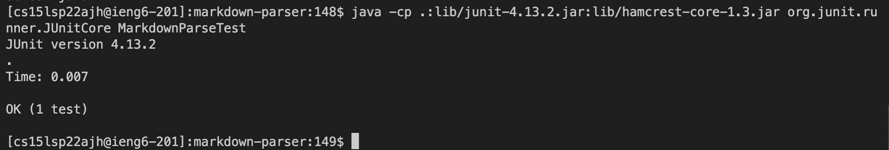   
### Combine 'scp' and 'ssh' to run both at the same time   
- We can combine the commands to expedite the process   
- 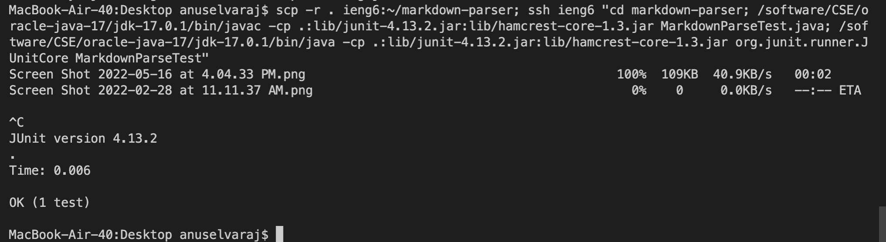   

