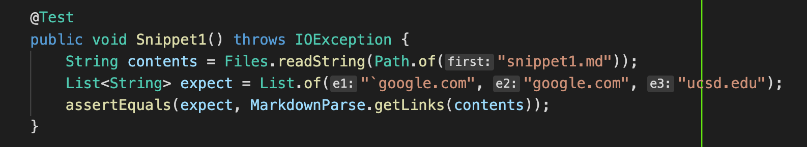
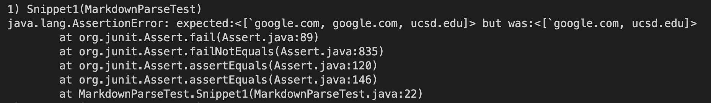
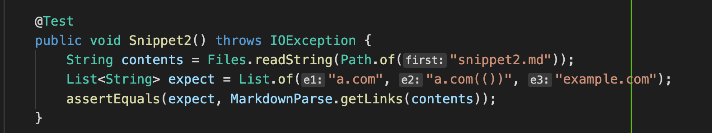
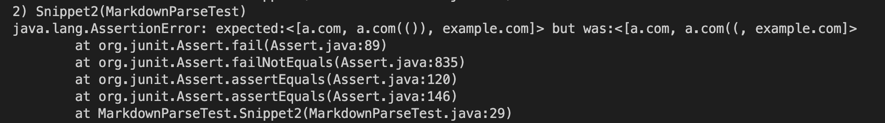
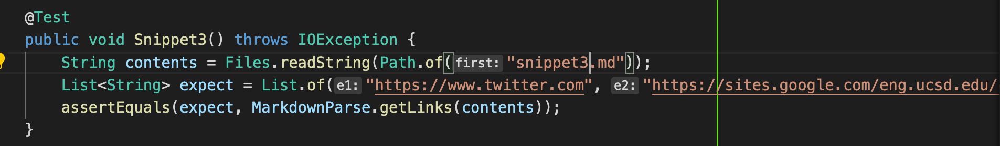
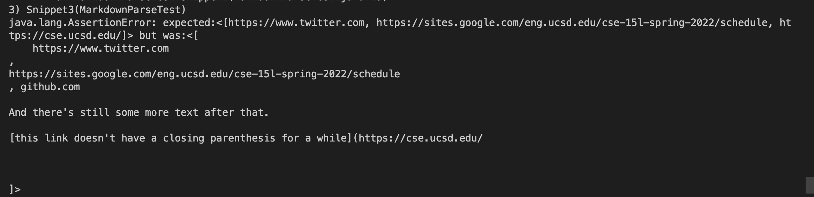
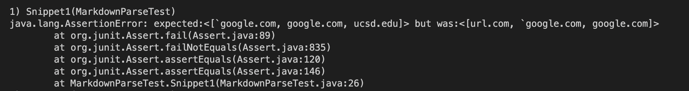
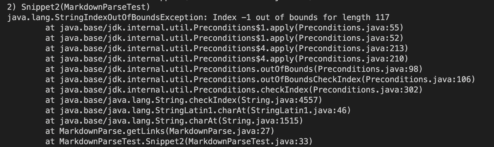
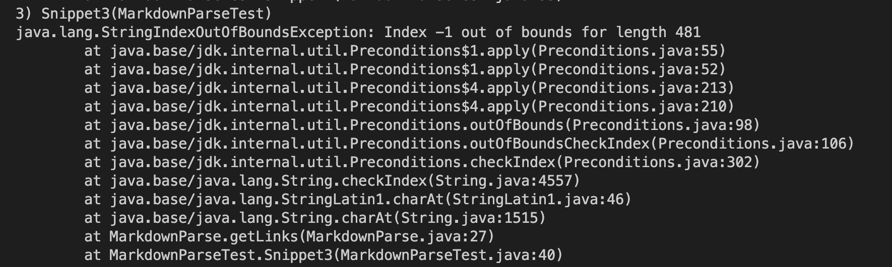

# Lab Report 4 Week 8

## First, we clone our repository and the one to be reviewed.

### Our repository
- [My Repo](https://github.com/anselvar/markdown-parser)

### Repository to be reviewed 
- [Their Repo](https://github.com/TheJoeship/markdown-parser-fork)

## My Repository   
### Three tests in my repo
-    
- TEST FAILED   
-     

-    
- TEST FAILED   
-    

-    
- TEST FAILED   
-    

## Repository to be Reviewed   
### Three tests in their repo
-    
- TEST FAILED   
-   

-    
- TEST FAILED   
-     

-     
- TEST FAILED   
-   

## Question 1   
- Do you think there is a small (<10 lines) code change that will make your program work for snippet 1 and all related cases that use inline code with backticks? If yes, describe the code change. If not, describe why it would be a more involved change.   
-  I think there could be a small change that would allow my program to work for these cases in the same way that we wrote test cases to skip over extra parentheses. This way it could check for the second backtick or skip over it. 

## Question 2   
- Do you think there is a small (<10 lines) code change that will make your program work for snippet 2 and all related cases that nest parentheses, brackets, and escaped brackets? If yes, describe the code change. If not, describe why it would be a more involved change.   
- I think the code for this will be a longer, more involved change since more than ten lines will be needed to handle each individual nested case. Since there are nested, different changes would need to be made per file or a much longer method is needed to fix this. 

## Question 3   
- Do you think there is a small (<10 lines) code change that will make your program work for snippet 3 and all related cases that have newlines in brackets and parentheses? If yes, describe the code change. If not, describe why it would be a more involved change.   
- I think the code would be longer than ten lines. The code for new lines in parentheses that exists is already long, and we would need even more changes to the code in order to account for both parentheses and brackets. 
