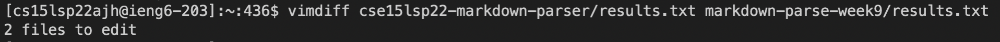
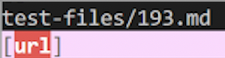
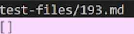
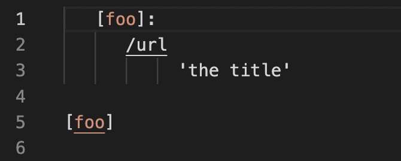
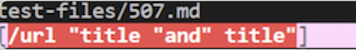
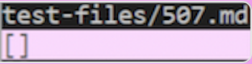
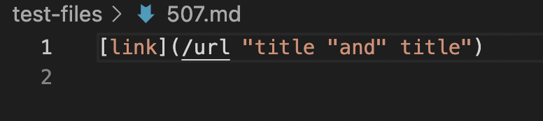

# Lab Report 5 Week 10

## Results.txt   
-   First, we copy the results.txt file into our cloned repository

## vim diff   
- Then we use this vim diff command in order to see the differences in the test files.
- 
- Then we find two test files with different results. 

## First error
- [test1](https://github.com/nidhidhamnani/markdown-parser/blob/main/test-files/193.md)
# Result from my repo   
-    
# Result from their repo   
- 

- The test file for their repo passed the test, while mine did not.
-    
- This code should produce no link, but my code did not detect the lack of parentheses, and considered whatever was after the brackets as a link. Instead, it should detect that there is no actual url inside. 

## Second error   
- [test2](https://github.com/nidhidhamnani/markdown-parser/blob/main/test-files/507.md)   
# Result from my repo
-   
# Result from their repo   
- 

The test file for their repo passed the test, while mine did not.
-
- This code should produce no link, but instead it detects the text inside as a url when it is not. Instead it should detec that there are just phrases, not a url inside. 
